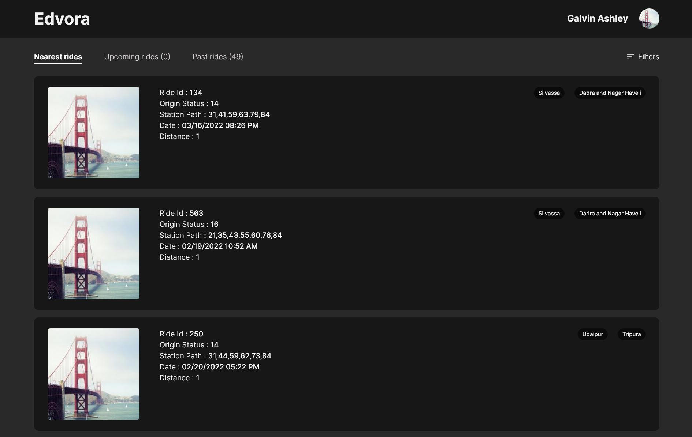

# Edvora Rides Project

This is a solution to the [Edvora Rides Project](https://www.figma.com/file/D0I5TsR7XGQECn8I1bia3L/Desktop-test?node-id=0%3A1). 

## Table of contents

- [Edvora Rides Project](#edvora-rides-project)
  - [Table of contents](#table-of-contents)
  - [Overview](#overview)
    - [The challenge](#the-challenge)
    - [Screenshot](#screenshot)
  - [My process](#my-process)
    - [Built with](#built-with)
  - [Author](#author)

## Overview
### The challenge

Users should be able to:

- View the optimal layout for the site depending on their device's screen size
- See hover states for all interactive elements on the page
- Open a filter dropdown by clicking on the filter button
- Nearest Rides
- Upcoming Rides
- Past Rides
- Filtered rides according to the state you have choose.
- Filtered rides according to the city you have choose.

### Screenshot

## My process

### Built with

- Semantic HTML5 markup
- CSS custom properties
- Flexbox
- Mobile-first workflow
- Vanilla JavaScript

As I am currently learning the React.js Thats why I build this entire project using the Vanilla Javascipt only, hope it will be considered.

## Author

- Githun - [Rohit Gour](https://github.com/Rohitgour03)
- Codepen - [@Rohitgour03](https://codepen.io/rohitgour03)
- Twitter - [@Rohitgour03](https://www.twitter.com/Rohitgour03)

